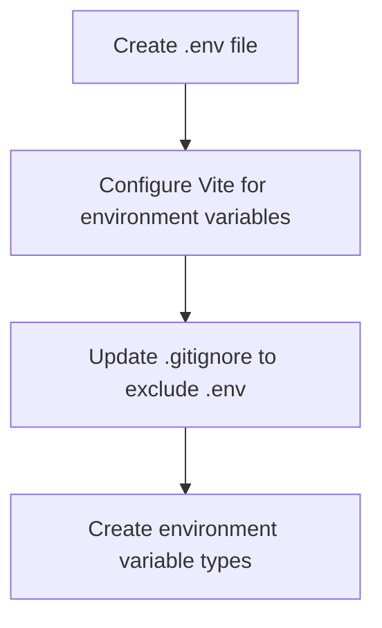
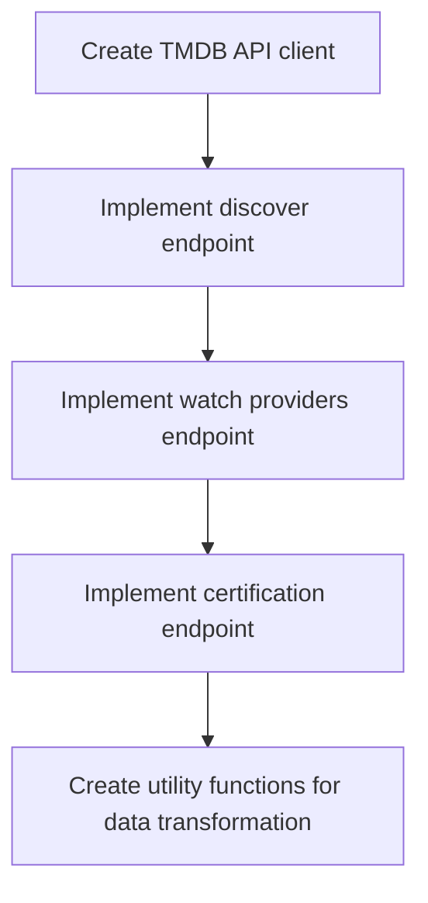
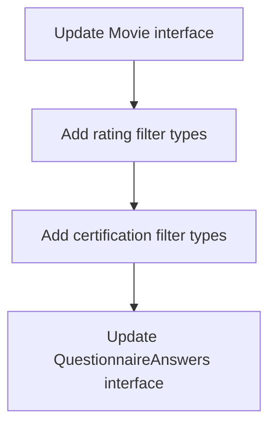
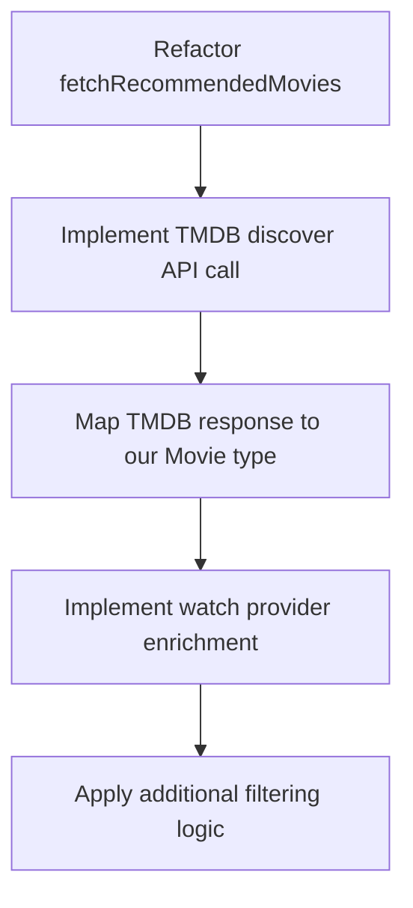
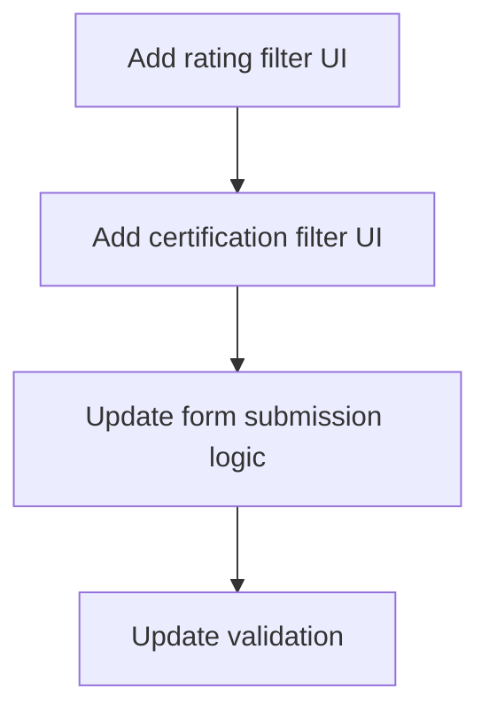
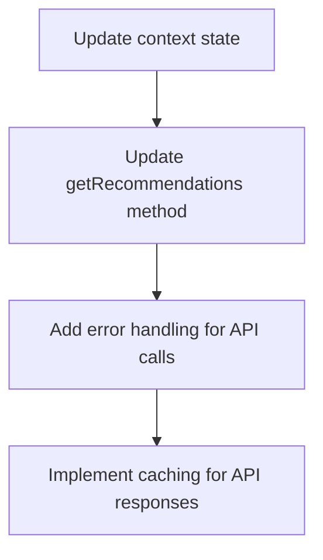
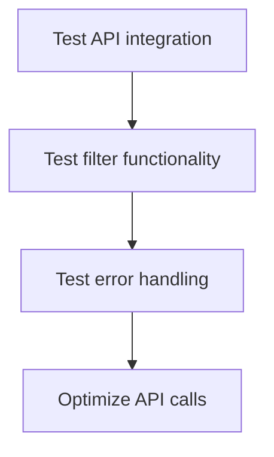

# TMDB API Integration Plan for Popcorn Pick

## 1. Overview

We'll enhance the Popcorn Pick application by replacing the mock movie data with real data from TMDB's API, focusing on implementing:
- Rating (vote average) filter
- Content rating (certification) filter
- Integration with existing filters (genre, duration, mood)
- Two-step approach for streaming platforms: fetch recommendations first, then enrich with watch provider data

## 2. Environment Setup



1. Create a `.env` file to store the TMDB API key
2. Configure Vite to use environment variables
3. Update `.gitignore` to exclude the `.env` file
4. Create type definitions for environment variables

## 3. TMDB API Service Implementation



1. Create a TMDB API client with base configuration
2. Implement the discover endpoint with filter parameters
3. Implement the watch providers endpoint
4. Implement the certification endpoint
5. Create utility functions to transform TMDB data to our application format

## 4. Update Movie Types



1. Update the `Movie` interface to match TMDB data structure
2. Add types for rating filters
3. Add types for certification filters
4. Update the `QuestionnaireAnswers` interface to include new filter options

## 5. Update Movie Service



1. Refactor the `fetchRecommendedMovies` function to use TMDB API
2. Implement the TMDB discover API call with filter parameters
3. Map the TMDB response to our `Movie` type
4. Implement the watch provider enrichment for displayed results
5. Apply additional filtering logic not available in TMDB API

## 6. Update Questionnaire Page



1. Add UI components for rating filter
2. Add UI components for certification filter
3. Update form submission logic to include new filters
4. Update validation for new filter options

## 7. Update Movies Context



1. Update the context state to include new filter options
2. Update the `getRecommendations` method to use the new service
3. Add error handling for API calls
4. Implement caching for API responses to reduce API calls

## 8. Testing and Refinement



1. Test the API integration with various filter combinations
2. Test the filter functionality to ensure correct results
3. Test error handling for API failures
4. Optimize API calls to minimize rate limiting issues

## 9. Detailed Implementation Steps

### Step 1: Environment Setup

1. Create a `.env` file in the project root:
```
VITE_TMDB_API_KEY=your_api_key_here
VITE_TMDB_API_BASE_URL=https://api.themoviedb.org/3
```

2. Update `vite-env.d.ts` to include environment variable types:
```typescript
/// <reference types="vite/client" />

interface ImportMetaEnv {
  readonly VITE_TMDB_API_KEY: string;
  readonly VITE_TMDB_API_BASE_URL: string;
}

interface ImportMeta {
  readonly env: ImportMetaEnv;
}
```

### Step 2: Create TMDB API Client

Create a new file `src/services/tmdbApi.ts`:
```typescript
const BASE_URL = import.meta.env.VITE_TMDB_API_BASE_URL;
const API_KEY = import.meta.env.VITE_TMDB_API_KEY;

// Base fetch function with error handling
async function fetchFromTMDB(endpoint: string, params: Record<string, any> = {}) {
  const queryParams = new URLSearchParams({
    api_key: API_KEY,
    ...params
  });
  
  const url = `${BASE_URL}${endpoint}?${queryParams}`;
  
  try {
    const response = await fetch(url);
    
    if (!response.ok) {
      throw new Error(`TMDB API error: ${response.status} ${response.statusText}`);
    }
    
    return await response.json();
  } catch (error) {
    console.error('Error fetching from TMDB:', error);
    throw error;
  }
}

// Discover movies with filters
export async function discoverMovies(params: Record<string, any> = {}) {
  return fetchFromTMDB('/discover/movie', params);
}

// Get movie details
export async function getMovieDetails(movieId: number) {
  return fetchFromTMDB(`/movie/${movieId}`);
}

// Get movie watch providers
export async function getMovieWatchProviders(movieId: number) {
  return fetchFromTMDB(`/movie/${movieId}/watch/providers`);
}

// Get movie certifications
export async function getMovieCertifications() {
  return fetchFromTMDB('/certification/movie/list');
}
```

### Step 3: Update Movie Types

Update `src/types/movie.ts` to include new filter options:
```typescript
// Add rating filter options
export const RATING_OPTIONS = [
  { value: 7.5, label: '7.5+' },
  { value: 8, label: '8+' },
  { value: 8.5, label: '8.5+' },
  { value: 9, label: '9+' },
  { value: 0, label: 'Any rating' }
];

// Add certification options (US ratings)
export const CERTIFICATION_OPTIONS = [
  { value: 'G', label: 'G - General Audiences' },
  { value: 'PG', label: 'PG - Parental Guidance Suggested' },
  { value: 'PG-13', label: 'PG-13 - Parents Strongly Cautioned' },
  { value: 'R', label: 'R - Restricted' },
  { value: 'NC-17', label: 'NC-17 - Adults Only' },
  { value: '', label: 'Any certification' }
];

// Update QuestionnaireAnswers interface
export interface QuestionnaireAnswers {
  mood: string;
  duration: number;
  platforms: string[];
  includeWatched: boolean;
  maxResults: number;
  minRating: number; // New field
  certification: string; // New field
}
```

### Step 4: Update Movie Service

Update `src/services/movieService.ts` to use TMDB API:
```typescript
import { Movie, QuestionnaireAnswers } from '../types/movie';
import { Profile } from '../types/profile';
import { discoverMovies, getMovieWatchProviders } from './tmdbApi';

// Map TMDB genre IDs to our genre IDs
const genreIdMap: Record<string, number> = {
  '28': 28, // Action
  '12': 12, // Adventure
  '16': 16, // Animation
  // ... add all genre mappings
};

// Map provider IDs to our provider keys
const providerIdMap: Record<number, string> = {
  8: 'netflix',
  337: 'disney',
  9: 'amazon',
  // ... add all provider mappings
};

// Transform TMDB movie to our Movie type
function transformTMDBMovie(tmdbMovie: any): Movie {
  return {
    id: tmdbMovie.id,
    title: tmdbMovie.title,
    overview: tmdbMovie.overview,
    poster_path: tmdbMovie.poster_path 
      ? `https://image.tmdb.org/t/p/w500${tmdbMovie.poster_path}`
      : 'https://via.placeholder.com/500x750',
    backdrop_path: tmdbMovie.backdrop_path
      ? `https://image.tmdb.org/t/p/original${tmdbMovie.backdrop_path}`
      : 'https://via.placeholder.com/1920x1080',
    release_date: tmdbMovie.release_date,
    vote_average: tmdbMovie.vote_average,
    genre_ids: tmdbMovie.genre_ids,
    runtime: tmdbMovie.runtime || 120, // Default runtime if not available
    providers: {}, // Will be populated later
    contentRatings: {
      violence: 3, // Default values
      language: 3,
      sexualContent: 3,
      frightening: 3
    }
  };
}

// Fetch recommended movies from TMDB
export const fetchRecommendedMovies = async (
  answers: QuestionnaireAnswers,
  profiles: Profile[]
): Promise<Movie[]> => {
  try {
    // Calculate common genres across all profiles
    const favoriteGenreIds = new Set<string>();
    const dislikedGenreIds = new Set<string>();
    
    profiles.forEach(profile => {
      profile.favoriteGenres.forEach(genreId => favoriteGenreIds.add(genreId));
      profile.dislikedGenres.forEach(genreId => dislikedGenreIds.add(genreId));
    });
    
    // Remove genres that are disliked by any family member
    const filteredGenres = Array.from(favoriteGenreIds)
      .filter(genreId => !dislikedGenreIds.has(genreId));
    
    // Build TMDB API parameters
    const params: Record<string, any> = {
      sort_by: 'popularity.desc',
      include_adult: false,
      with_runtime.lte: answers.duration < 999 ? answers.duration : undefined,
      'vote_average.gte': answers.minRating > 0 ? answers.minRating : undefined,
      certification_country: answers.certification ? 'US' : undefined,
      certification: answers.certification || undefined,
    };
    
    // Add genres if available
    if (filteredGenres.length > 0) {
      params.with_genres = filteredGenres.join('|');
    }
    
    // Fetch movies from TMDB
    const response = await discoverMovies(params);
    
    // Transform TMDB movies to our Movie type
    let movies = response.results.map(transformTMDBMovie);
    
    // Fetch watch providers for each movie (only for displayed results)
    const moviesWithProviders = await Promise.all(
      movies.slice(0, answers.maxResults).map(async (movie) => {
        try {
          const providersResponse = await getMovieWatchProviders(movie.id);
          const results = providersResponse.results;
          
          // Get providers for user's region (default to US if not available)
          const regionProviders = results.US || results.GB || Object.values(results)[0] || {};
          const flatrate = regionProviders.flatrate || [];
          
          // Map provider IDs to our provider keys
          const providers: Record<string, boolean> = {};
          flatrate.forEach((provider: any) => {
            const providerKey = providerIdMap[provider.provider_id];
            if (providerKey) {
              providers[providerKey] = true;
            }
          });
          
          return {
            ...movie,
            providers
          };
        } catch (error) {
          console.error(`Error fetching providers for movie ${movie.id}:`, error);
          return movie;
        }
      })
    );
    
    // Filter by platforms if specified
    let filteredMovies = moviesWithProviders;
    if (answers.platforms.length > 0) {
      filteredMovies = filteredMovies.filter(movie => {
        if (!movie.providers) return false;
        return answers.platforms.some(platform => movie.providers?.[platform]);
      });
    }
    
    // Calculate match score and reason
    filteredMovies = filteredMovies.map(movie => {
      const genreOverlap = movie.genre_ids
        .filter(id => filteredGenres.includes(id.toString()))
        .length;
      
      const matchScore = Math.min(100, Math.round((genreOverlap / Math.max(1, movie.genre_ids.length)) * 100));
      
      let matchReason = "This movie matches your family's preferences";
      if (genreOverlap > 0) {
        matchReason += " for " + genreOverlap + " favorite genres";
      }
      if (answers.mood) {
        matchReason += ` and fits your ${answers.mood} mood`;
      }
      if (answers.platforms && answers.platforms.length > 0 && movie.providers) {
        const availablePlatforms = answers.platforms
          .filter(platform => movie.providers?.[platform])
          .map(platform => {
            const platformMap: {[key: string]: string} = {
              netflix: 'Netflix',
              disney: 'Disney+',
              amazon: 'Amazon Prime',
              hbo: 'HBO Max',
              hulu: 'Hulu',
              apple: 'Apple TV+',
              paramount: 'Paramount+',
              peacock: 'Peacock'
            };
            return platformMap[platform];
          });
        
        if (availablePlatforms.length > 0) {
          matchReason += `. Available on ${availablePlatforms.join(', ')}`;
        }
      }
      
      return {
        ...movie,
        matchReason,
        matchScore
      };
    }).sort((a, b) => (b.matchScore || 0) - (a.matchScore || 0));
    
    return filteredMovies;
  } catch (error) {
    console.error('Error fetching recommended movies:', error);
    throw error;
  }
};
```

## 10. Considerations and Challenges

1. **API Rate Limiting**: TMDB has rate limits, so we need to implement caching and optimize API calls.
2. **Error Handling**: Robust error handling for API failures is essential.
3. **Performance**: The two-step approach (fetch recommendations, then enrich with providers) may impact performance for large result sets.
4. **Data Transformation**: Mapping between TMDB data structure and our application structure requires careful implementation.
5. **UI Updates**: The UI needs to be updated to accommodate the new filter options.